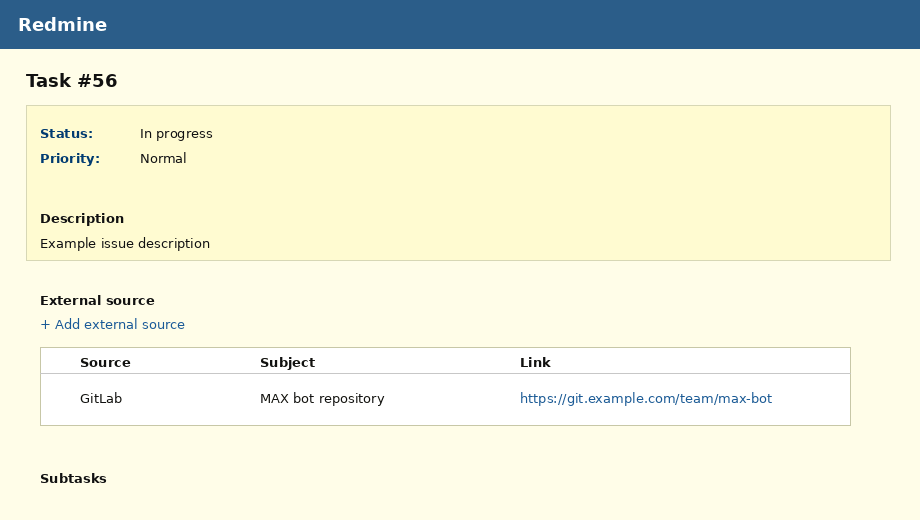
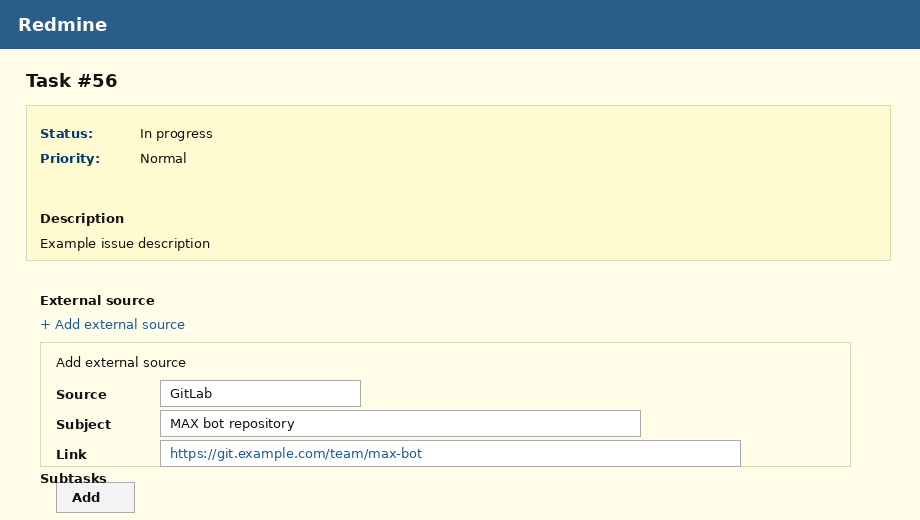

# Redmine External Source Links

[](https://github.com/SKonovalovS/redmine-external-source/releases)
[](LICENSE)
[](https://www.redmine.org/)
[](https://github.com/SKonovalovS/redmine-external-source/releases)
[](https://github.com/SKonovalovS/redmine-external-source/actions/workflows/compatibility.yml)

**Redmine External Source Links** adds a native-looking **External source** section to Redmine issue pages. It lets teams attach links to external systems such as Jira, GitLab, GitHub, Confluence, BookStack, Bitbucket, Telegram, MAX, YouTube, Alfresco, another Redmine, and custom sources.

The plugin does **not** synchronize statuses and does **not** require external API credentials. It stores a source type, subject and URL, shows source icons, supports ordering, writes issue journal notes and exposes a JSON REST API.



## Features

- Edit existing external sources with a pencil action or by double-clicking a row

- Native Redmine issue-page section: **External source**.
- Enable or disable per project via **Project settings → Modules**.
- Role permissions:
  - view external sources;
  - manage external sources.
- Built-in sources with icons:
  - Jira;
  - Redmine (external);
  - BookStack;
  - Alfresco;
  - Confluence;
  - Telegram;
  - MAX;
  - GitLab;
  - GitHub;
  - Bitbucket;
  - YouTube;
  - Other.
- Custom source types via plugin settings.
- Add, delete and reorder external source links.
- Drag & drop sorting.
- One-click link copy.
- Issue journal notes for add/update/delete/sort operations.
- RU/EN localization.
- JSON REST API.
- Compatible with Redmine 5.0.x, 5.1.x and prepared for 6.x.

## Screenshots

### Issue page


### Add external source



## Installation

Clone or unpack the plugin into the Redmine `plugins` directory. The directory name must be exactly:

```text
redmine_external_issue_links
```

```bash
cd /path/to/redmine/plugins
git clone https://github.com/SKonovalovS/redmine-external-source.git redmine_external_issue_links

cd /path/to/redmine
bundle exec rake redmine:plugins:migrate RAILS_ENV=production
bundle exec rake tmp:cache:clear RAILS_ENV=production
sudo systemctl restart redmine
```

For Docker-based installations, place the plugin into the volume or host directory used as the source for Redmine plugins, then restart the Redmine container.

## Enable the project module

1. Open a project.
2. Go to **Settings → Modules**.
3. Enable **External source**.
4. Go to **Administration → Roles and permissions**.
5. Grant:
   - **View external sources**;
   - **Manage external sources**.

## Custom sources

Go to **Administration → Plugins → Redmine External Source Links → Configure**.

Example:

```yaml
- key: sharepoint
  label: SharePoint
  icon: external.svg
- key: support_portal
  label: Support Portal
  icon: external.svg
```

Custom icons should be placed in:

```text
plugins/redmine_external_issue_links/assets/images/source_icons/
```

Then use the file name in the `icon` field.

## REST API

Full API documentation: [docs/API.md](docs/API.md)

Quick example:

```http
POST /issues/:issue_id/external_issue_links.json
Content-Type: application/json

{
  "external_issue_link": {
    "source_type": "gitlab",
    "subject": "MAX bot repository",
    "url": "https://git.example.com/team/max-bot"
  }
}
```

## Compatibility

The plugin uses standard Redmine mechanisms:

- project modules;
- permissions;
- hooks;
- Rails controllers;
- ActiveRecord migrations;
- issue journals.

The compatibility workflow checks Redmine 5.0, 5.1 and 6.x on GitHub Actions.

## Development

```bash
git clone https://github.com/SKonovalovS/redmine-external-source.git redmine_external_issue_links
```

After changing code, run plugin migrations in a test Redmine instance:

```bash
bundle exec rake redmine:plugins:migrate RAILS_ENV=production
```

## Release process

Create a version tag:

```bash
git tag -a v1.2.0 -m "Release 1.2.0"
git push origin v1.2.0
```

The release workflow builds a ZIP archive automatically.

## Author

[Konovalov Semyon](https://github.com/SKonovalovS)

## License

MIT License. See [LICENSE](LICENSE).
